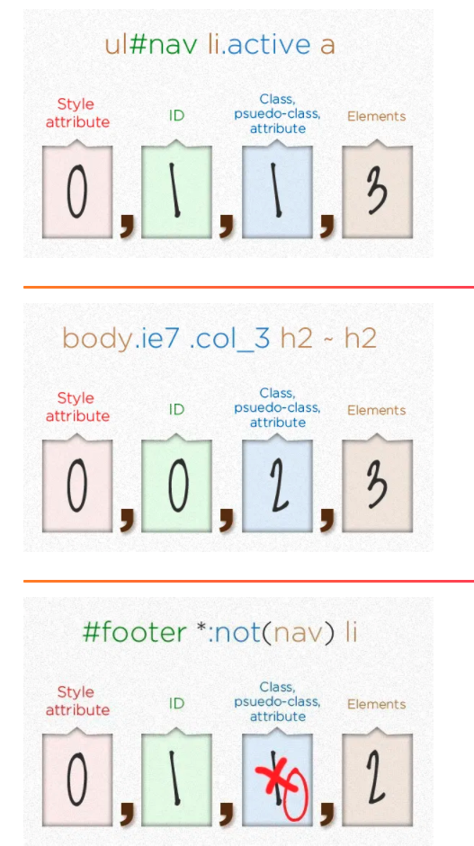
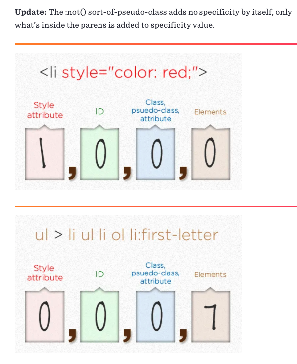
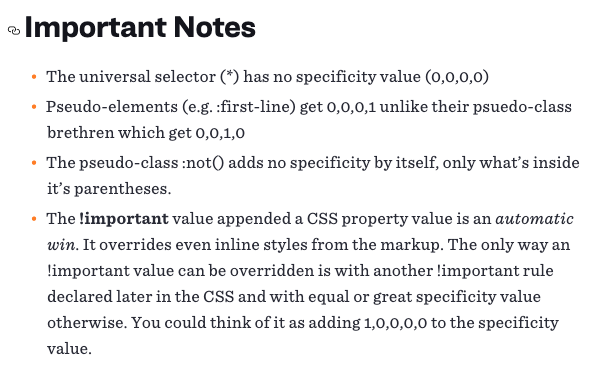

## CSS Structure

1. What does CSS contain
    - @charset
    - @import
    - rules
        - @media
        - @page
        - rule
2. The 3 important at-rules: @media, @keyframes and @fontface

## Selector grammar

1. Simple Selector
    1. *
    2. div svg|a
    3. .cls
    4. #id
    5. [attr=value]
    6. :hover
    7. ::before
2. Combined Selector (different from Selector List; Combined Selector is AND relationship, each simple selector is concatenated with the next simple selector with no space in between; Selector List is OR relationship, using comma as delimiter )
    1. <Simple Selector> <Simple Selector> <Simple Selector> (with no space in between)
    2. * or div must be written at the start
3. Combinator:
    1. <Simple Selector> <sp> <Simple Selector> (<sp> is space)
    2. <Simple Selector> ">" <Simple Selector>
    3. <Simple Selector> "~" <Simple Selector>
    4. <Simple Selector> "+" <Simple Selector>
    5. <Simple Selector> "||" <Simple Selector>
4. Specificity Calculation Examples:

    

    

    

5. Pesudo Class Selector
    1. :any-link
    2. :link :visited
    3. :hover
    4. :active
    5. :focus
    6. :target

### **思考：为什么 first-letter 可以设置 float 之类的，而 first-line 不行呢？**

::first-line 针对的是第一行被格式化的row， 并且它的子元素需要被放置在同一个流中，给:first-line设置flaot会使元素的流产生变化，所以不能对其设置float